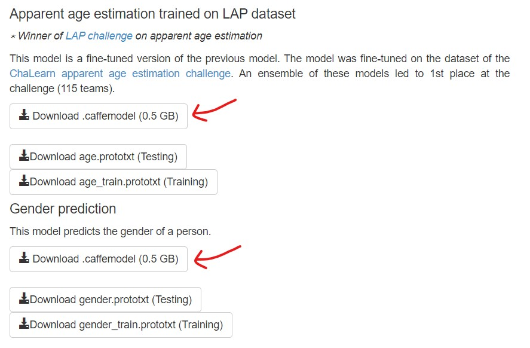

# Face Age Gender Detection

A program to detect faces in an image and identifying the person as a "Male" or "Female" and also give an approximate estimate of their age.

**Additional Files**

The following two more files are necessary for this program to work:
- 'dex_chalearn_iccv2015.caffemodel' (513 MB)</li>
- 'gender.caffemodel' (513 MB)</li>

Due to their huge sizes, instead of providing them here, I am providing the link to the website to download them from:

<https://data.vision.ee.ethz.ch/cvl/rrothe/imdb-wiki/>

The necessary file are marked in the following picture:

**Citations**

[@Rothe-IJCV-2018]

[Rothe-ICCVW-2015]
