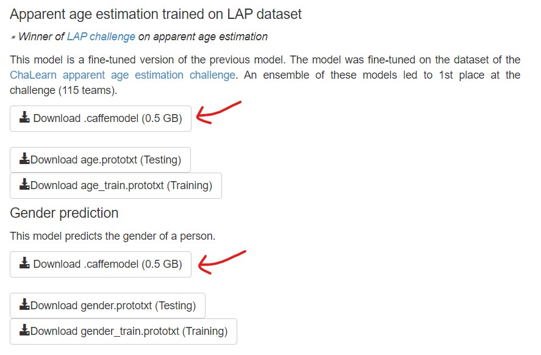

## Additional Files

The following two more files are necessary for this program to work:
- `dex_chalearn_iccv2015.caffemodel` (513 MB)</li>
- `gender.caffemodel` (513 MB)</li>

Due to their huge sizes, instead of providing them here, I am providing the link to the website from where they can be downloaded.

<https://data.vision.ee.ethz.ch/cvl/rrothe/imdb-wiki/>

The necessary files are marked in the following picture:

Once downloaded, place those two files in the 'models' folder.

## References for the pre-trained models

- Article: Rothe-IJCV-2018
	- Author: Rasmus Rothe, Radu Timofte and Luc Van Gool
	- Title: Deep expectation of real and apparent age from a single image without facial landmarks
	- Journal: International Journal of Computer Vision
	- Volume: 126
	- Number: 2 - 4
	- Pages: 144 - 157
	- Year: 2018
	- Publisher: Springer
	
- In Proceedings: Rothe-ICCVW-2015
	- Author: Rasmus Rothe and Radu Timofte and Luc Van Gool
	- Title: DEX: Deep EXpectation of apparent age from a single image
	- Booktitle: IEEE International Conference on Computer Vision Workshops (ICCVW)
	- Year: 2015
	- Month: December
